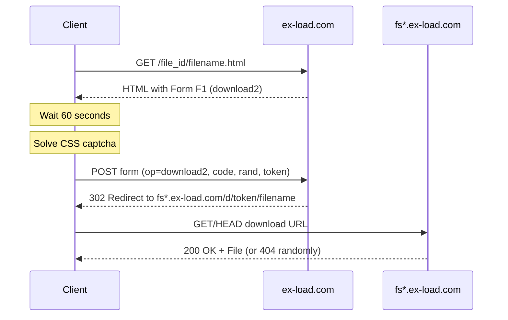

# ExLoad (ex-load.com) - Technical Analysis

## Overview

ExLoad is a file hosting service using XFilesharing script with multi-step download process, CSS-based captcha, and IP-bound download tokens.

## Download Flow



## Form Structure

### Initial Page Contains Two Forms:

| Form | op value | Purpose |
|------|----------|---------|
| Form 1 | `download1` | Unused legacy form |
| Form F1 | `download2` | **Main download form** |

### Form F1 Fields:
```
op: download2
id: {file_id}
rand: {random_token}
referer: 
token: {session_token}
method_free: 
method_premium: 
code: {solved_captcha}
down_script: 1
adblock_detected: 0
```

## Captcha System

**Type:** CSS Position-Based (same as FileDot, DesiUpload)

### HTML Structure:
```html
<div style="width:80px;height:26px;font:bold 13px Arial;background:#ccc">
  <span style="position:absolute;padding-left:45px;padding-top:6px;">3</span>
  <span style="position:absolute;padding-left:6px;padding-top:7px;">3</span>
  <span style="position:absolute;padding-left:27px;padding-top:7px;">2</span>
  <span style="position:absolute;padding-left:61px;padding-top:4px;">1</span>
</div>
```

### Solution Algorithm:
1. Extract all `<span>` elements
2. Parse `padding-left` value from style
3. Sort by padding-left (left to right)
4. Concatenate digits

**Example:** padding-left values [45, 6, 27, 61] → sorted [6, 27, 45, 61] → code: `3231`

## Countdown Requirement

- **Duration:** 60 seconds (mandatory)
- **Server Validation:** Yes, server tracks time between page load and form submit
- **Bypass Attempt Result:** `<div class="err">Skipped countdown</div>`

## Download URL Characteristics

### Format:
```
https://fs{N}.ex-load.com/d/{token}/{filename}
```

### Token Properties:
| Property | Value |
|----------|-------|
| Length | ~50 characters |
| Tied to IP | **YES** |
| Tied to Session | No (no cookies required) |
| Expiration | Unknown (still valid after hours) |
| Reusable | Yes (with retry) |

## IP Binding Analysis

### Test Results:

| Source IP | Success Rate |
|-----------|--------------|
| Original IP (form submitter) | ~50-60% |
| Different IP (via proxy) | **0%** |

### Conclusion:
The download token is **cryptographically bound** to the IP that submitted the form. Requests from different IPs receive 404 Not Found.

## Backend Architecture

### DNS Resolution:
```
fs39.ex-load.com → 188.208.196.168 (single IP)
```

### Server Stack:
- **Edge:** No Cloudflare for storage servers
- **Web Server:** nginx
- **Architecture:** Single IP, multiple backend storage nodes

### Load Balancing Behavior:

```
Client → nginx (188.208.196.168) → [Backend 1, Backend 2, Backend 3, ...]
                                        ↓           ↓           ↓
                                      200 OK      404       200 OK
```

**Finding:** Request-level load balancing to multiple storage backends. File not replicated to all nodes.

### Test Evidence:

| Test Type | Result |
|-----------|--------|
| Sequential requests | 27% success |
| Concurrent requests | 60% success |
| Keep-Alive connection | Still inconsistent |

**Conclusion:** nginx proxies each request to different backends, even on same TCP connection.

## Implementation Requirements

### Mandatory:
1. **60 second wait** - Server validates countdown
2. **Same IP** - Token bound to form submitter IP (resolver stores proxy in `self.proxy`)
3. **Retry logic** - Backend load balancing causes random 404s (5 retries by default)

### Configuration (hosts_config.yaml):
```yaml
ex-load.com:
  max_connections: 1              # IP-bound token, single connection required
  max_concurrent: 10
  download_with_aria2c: true
  resolver: "ExloadResolver"
  use_random_proxy: true          # Uses same proxy for resolve and aria2c
  ignore_ssl: true
  max_retries: 5                  # Retry due to backend load balancing
  aria2c_max_tries: 5             # Retry in aria2c for 404s
```

### Resolver Implementation:
```python
# ExloadResolver stores proxy for aria2c to use
self.proxy = get_random_proxy()  # Stored during __aenter__
# aria2c receives this via resolver.proxy in main.py
```

## Headers

### Request Headers (sufficient):
```
User-Agent: Mozilla/5.0 (Windows NT 10.0; Win64; x64) ...
Accept: text/html,application/xhtml+xml,...
Content-Type: application/x-www-form-urlencoded
```

### Response Headers (successful download):
```
HTTP/1.1 200 OK
Server: nginx
Content-Type: application/octet-stream
Content-Length: {file_size}
Content-Disposition: attachment
Accept-Ranges: bytes
```

## Resolver Implementation

Location: `fetchr/hosts/exload.py`

### Key Methods:
- `_extract_download_form_data()` - Targets form name="F1"
- `get_download_info()` - Full flow with redirect handling
- Uses `fetchr.captcha.solve_css_position_captcha()`

### Flow:
1. GET page → extract form F1
2. Solve CSS captcha
3. Wait 60 seconds
4. POST form → receive 302 redirect
5. Extract Location header as download URL
6. HEAD request to verify and get file size

## Related Files

| File | Purpose |
|------|---------|
| `fetchr/hosts/exload.py` | Main resolver |
| `fetchr/captcha/css_position.py` | Shared captcha solver |
| `fetchr/captcha/__init__.py` | Captcha module exports |

## Limitations

1. **Speed:** 75 Kb/s for free users
2. **Daily limit:** 1 file per day (free)
3. **Wait time:** 60 seconds mandatory
4. **Reliability:** ~50% success rate per request due to backend architecture
